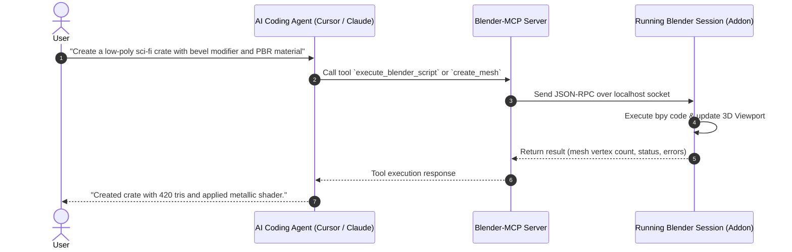

# 🎨 Blender Agent Skills & Blender-MCP

Integrating AI agents into Blender involves two powerful components:
1. **Procedural Knowledge & Recipes (`arjun988/blender-skills`)**: An extensive repository of 94+ modular agent skills covering modeling, retopology, geometry nodes, shaders, and rendering.
2. **Live Execution Bridge (`Gorav22/Blender-mcp`)**: A Model Context Protocol (MCP) server and Blender addon that enables an AI agent (Claude Code, Cursor, Windsurf) to execute Python commands and inspect live scene graphs in real-time.

---

## 📦 1. Blender-Skills Repository
* **Repository**: [arjun988/blender-skills](https://github.com/arjun988/blender-skills)
* **Author**: Arjun Sharma
* **Skill Format**: Agent Skills standard (`SKILL.md`)
* **Coverage**: 94+ specialized skills

### Key Skill Domains Included:
- **Procedural Modeling & Geometry Nodes**: Creating parametric assets, procedural buildings, terrain generators, and foliage distribution.
- **Topology & Retopology**: Quad-based edge loops, baking high-poly sculpts to low-poly game-ready meshes, unwrapping UVs with minimal distortion.
- **Shader & Material Graph**: Automated Principled BSDF node setups, procedural PBR textures (dirt maps, edge wear, curvature masks).
- **Rigging & Armatures**: Bone placement conventions, weight painting heuristics, Rigify automation.
- **Pipeline & Exporting**: Automated glTF/FBX export presets for Unreal Engine and Unity (applying transforms, tangents, armature root fixes).

### Installation via Skills CLI:
```bash
# Install all blender skills into your agent
npx skills add arjun988/blender-skills

# Or install targeted skills
npx skills add arjun988/blender-skills --skill blender-geometry-nodes
npx skills add arjun988/blender-skills --skill blender-game-export
```

---

## ⚡ 2. Blender-MCP: Live Engine Bridge
* **Repository**: [Gorav22/Blender-mcp](https://github.com/Gorav22/Blender-mcp)
* **Protocol**: Model Context Protocol (MCP) over local WebSocket / stdio

### How It Works:


### Setup Instructions:
1. **Install Blender Addon**:
   - Download the addon zip from `Gorav22/Blender-mcp`.
   - In Blender: `Edit` > `Preferences` > `Add-ons` > `Install...`.
   - Enable the addon. It will start a local socket listener (default port: `9876`).
2. **Register MCP in Agent Config**:
   Add to your `claude_desktop_config.json` or Cursor MCP settings:
   ```json
   {
     "mcpServers": {
       "blender": {
         "command": "node",
         "args": ["path/to/blender-mcp/build/index.js"],
         "env": {
           "BLENDER_PORT": "9876"
         }
       }
     }
   }
   ```

---

## 🔗 Cross-Links & Next Steps
* Connect Blender exports directly into Unreal Engine: [[Unreal Engine 5 MCP & Skills]]
* Unified cross-tool automation: [[Unified 3D & Multi-Engine Frameworks]]
* Ready-to-copy MCP configurations: [[MCP Configuration for Game Dev (Blender, UE5, Unity)]]
