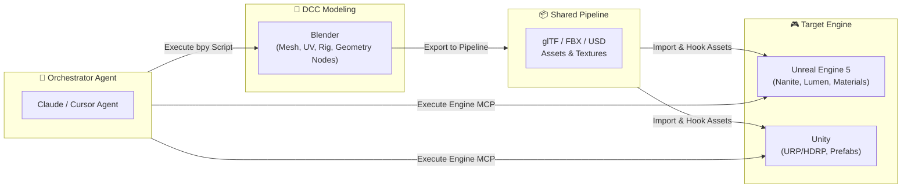

# 🌐 Unified 3D & Multi-Engine Frameworks

Instead of isolating 3D modeling and game engines into separate silos, unified multi-agent frameworks connect Blender, Unreal Engine, Unity, Godot, and Three.js into a single automated pipeline.

---

## 📦 1. Key Unified Repositories

### A. unreal-blender-mcp (Tahooki)
* **Repository**: [tahooki/unreal-blender-mcp](https://github.com/tahooki/unreal-blender-mcp)
* **Core Benefit**: One unified MCP server connecting both Blender and Unreal Engine 5 simultaneously.
* **Pipeline Flow**:
  1. Agent creates/modifies a 3D asset in Blender via Python.
  2. Agent exports to a shared interchange format (FBX / glTF) with standardized transforms (UE5 Z-up vs Blender Z-up).
  3. Agent instructs Unreal Engine to import the mesh, generate Nanite / LOD settings, and assign materials.

### B. GameFactory-3A (OpenDCAI)
* **Repository**: [OpenDCAI/GameFactory-3A](https://github.com/OpenDCAI/GameFactory-3A)
* **Vision**: An open-source 3A game generation framework for autonomous agents.
* **Supported Targets**: Unreal Engine 5, Blender, Unity, Godot, and Three.js.
* **Features**:
  - Multi-agent collaboration: Asset Agent (Blender), Level Designer (UE5/Unity), Gameplay Coder (C#/C++), and Sound/VFX Agent.
  - End-to-end procedural game generation pipelines.

### C. DCC-MCP Infrastructure
* **Repository**: [DCC-MCP](https://github.com/DCC-MCP)
* **Vision**: Universal standard protocol for Digital Content Creation tools (Maya, Houdini, Blender, Unreal, Unity).
* **Benefit**: Standardizes function calls across 3D tools so an AI agent uses the same high-level commands regardless of underlying software.

---

## 🔄 End-to-End Pipeline Visualization

---

## 💡 Practical Implementation Tips
1. **Coordinate Systems**: Blender uses right-handed Z-up, Unreal uses left-handed Z-up, Unity uses left-handed Y-up. Ensure skills enforce automatic transform compensation during export/import.
2. **USD (Universal Scene Description)**: When coordinating between Blender, Unreal, and Unity, encourage agents to use OpenUSD format for non-destructive interchange.
