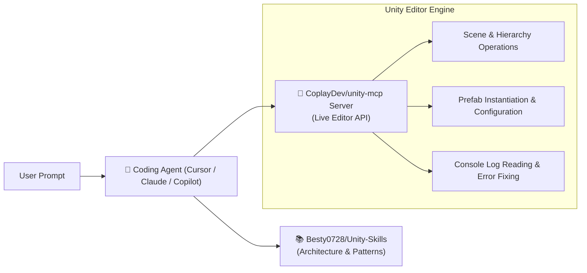

# 🎮 Unity MCP & Game Development Skills

Integrating AI agents with Unity combines C# script generation, scene hierarchy manipulation, and editor automation through specialized skills and MCP socket bridges.

---

## 📦 1. Key Repositories

### A. Unity-MCP (CoplayDev)
* **Repository**: [CoplayDev/unity-mcp](https://github.com/CoplayDev/unity-mcp)
* **What it does**: Bridges AI coding assistants directly into Unity's Editor via a background C# WebSocket / HTTP listener.
* **Capabilities**:
  - Inspect GameObject tree and component values.
  - Instantiate prefabs and configure transforms/colliders.
  - Read Unity console logs and compile errors.
  - Trigger compilation and enter Play Mode for automated verification.

### B. Unity-Skills (Besty0728)
* **Repository**: [Besty0728/Unity-Skills](https://github.com/Besty0728/Unity-Skills)
* **Format**: Agent Skills standard (`SKILL.md`)
* **Coverage**: Modular knowledge packages for Unity architecture:
  - **Component-Driven Game Design**: Decoupling game logic using ScriptableObjects (Ryan Hipple architecture).
  - **State Machines**: Implementing hierarchical finite state machines (HFSM) for character controllers and AI enemies.
  - **Input System (New)**: Action Maps, callbacks, and responsive gamepad/touch handling.
  - **Physics & Optimization**: FixedUpdate best practices, object pooling (`UnityEngine.Pool`), and avoiding Garbage Collection (GC) allocations in update loops.

---

## 🔄 Unity Agent Workflow Architecture



---

## 🚀 Quick Setup Instructions

1. **Install Skills**:
   ```bash
   npx skills add Besty0728/Unity-Skills
   ```
2. **Install Unity-MCP Package**:
   - In Unity: `Window` > `Package Manager` > `+ Add package from git URL...`
   - Enter `https://github.com/CoplayDev/unity-mcp.git`
3. **Register MCP in Agent Configuration**:
   ```json
   {
     "mcpServers": {
       "unity": {
         "command": "node",
         "args": ["path/to/unity-mcp/dist/index.js"]
       }
     }
   }
   ```

---

## 🎯 Common Senior Game Dev Rules For Agents
When working with Unity, instruct your agent to:
- **Avoid `Find()` and `GetComponent()` inside `Update()`**: Cache references in `Awake()` or inject via Inspector.
- **Use ScriptableObject Events**: Eliminate tightly coupled singletons for game state.
- **Enforce Layer & Tag Constants**: Generate type-safe enum wrappers for tags and layers.
