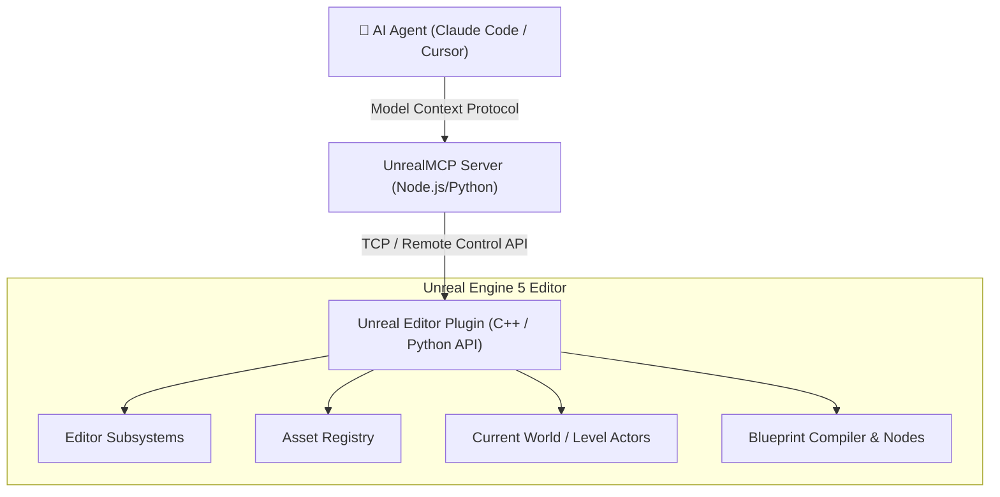

# ⚡ Unreal Engine 5 MCP & Skills

Automating Unreal Engine 5 with AI agents requires deep programmatic integration into the Unreal Editor environment (Subsystem execution, Python API, and C++ reflection).

---

## 📦 1. Key Repositories & Implementations

### A. UnrealMCP (Kvick Games)
* **Repository**: [kvick-games/UnrealMCP](https://github.com/kvick-games/UnrealMCP)
* **Core Technology**: UE5 Editor Plugin + MCP Server
* **Features**:
  - Direct scene inspection: Query actor hierarchies, components, and transform matrices.
  - Asset Registry search: Search static meshes, textures, materials, and Blueprints programmatically.
  - Level editing: Spawn actors, assign materials, configure collision profiles, and build lighting.
  - Blueprint introspection: Read exposed node graphs and variables.

### B. unreal-mcp (Flux Point Studios)
* **Repository**: [Flux-Point-Studios/unreal-mcp](https://github.com/Flux-Point-Studios/unreal-mcp)
* **Core Technology**: Native C++ Unreal Plugin
* **Features**:
  - High performance: Bypasses Python overhead by interacting directly through Unreal's internal C++ reflection and WebControl / Remote Execution sockets.
  - Automation scripts: Run level tests, package builds, and compile shaders directly from agent prompts.

### C. unreal-blender-mcp (Tahooki)
* **Repository**: [tahooki/unreal-blender-mcp](https://github.com/tahooki/unreal-blender-mcp)
* **Focus**: The unified bridge linking Blender's DCC workspace directly into Unreal Engine's Content Browser.

---

## 🏗️ Architecture & Interaction Flow

---

## 🛠️ Typical Agent Prompts & Workflow Capabilities

Once connected to your Unreal Engine 5 project, the agent can execute high-level game engineering instructions:

1. **Procedural Level Layout**:
   > *"Find all static meshes tagged 'ModularSciFi_Wall' in `/Game/Assets/` and spawn a 10x10 enclosed corridor with point lights every 400 units."*
2. **Material Instance Generation**:
   > *"Create a Material Instance from `M_MasterPBR`, set BaseColor to `(0.1, 0.5, 0.8)`, Roughness to `0.3`, and assign it to the selected static mesh actor."*
3. **Gameplay Blueprint Hookup**:
   > *"Inspect `BP_PlayerCharacter`, add an interaction trace on the 'E' key press, and trigger `I_Interactable` interface on hit."*

---

## ⚠️ Safety & Best Practices
- **Version Control**: Always run UE5 MCP connected to a clean Git/Perforce branch.
- **Save Dirty Packages**: Instruct your agent to explicitly run `save_package()` or `save_dirty_assets()` so in-memory changes persist to disk.
- **Cross-Engine Work**: See [[Unified 3D & Multi-Engine Frameworks]] for importing assets built in Blender.
