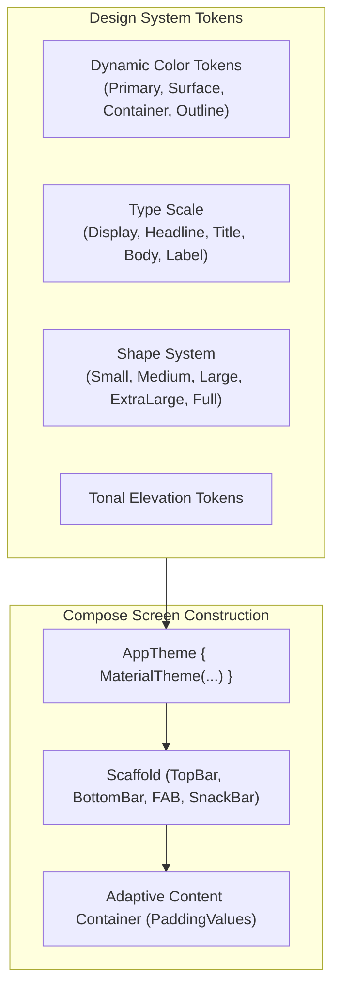

# 🎨 Jetpack Compose UI-UX Master Skill

To make an AI agent build Android applications with the aesthetic polish, responsiveness, and accessibility of a **Senior UI/UX Designer & Staff Android Engineer**, this skill equips the agent with concrete UI/UX rules.

---

## 🎯 1. Material Design 3 (M3) Expressive System



### Key UI/UX Principles Enforced:
1. **Never Hardcode Colors or Sizes**:
   - ❌ Bad: `Color(0xFF1E88E5)` or `fontSize = 16.sp`
   - ✅ Good: `MaterialTheme.colorScheme.primary` and `MaterialTheme.typography.bodyLarge`
2. **Scaffold Insets Handling**:
   - Always propagate `innerPadding` from `Scaffold` to prevent content from clipping beneath system status bars and navigation bars:
     ```kotlin
     Scaffold(
         topBar = { TopAppBar(title = { Text("Dashboard") }) }
     ) { innerPadding ->
         LazyColumn(
             contentPadding = innerPadding,
             modifier = Modifier.fillMaxSize()
         ) { ... }
     }
     ```

---

## 📱 2. Adaptive Layouts & Screen Support
Senior Android developers write UI that adapts gracefully across phone, foldable, and tablet form factors:
- **Use Adaptive Scaffolding**:
  - Implement `ListDetailPaneScaffold` or `SupportingPaneScaffold` from `androidx.compose.material3.adaptive`.
  - Calculate `WindowWidthSizeClass` (Compact, Medium, Expanded).
  - Compact (phones): Single-pane navigation stack.
  - Medium/Expanded (tablets/foldables): Side navigation rail + persistent dual-pane views.

---

## ♿ 3. Accessibility (TalkBack & Semantics)
An app is not senior-grade if it fails accessibility standards:
- **Touch Targets**: All clickable elements must satisfy minimum touch target size of **48.dp** (`Modifier.sizeIn(minWidth = 48.dp, minHeight = 48.dp)`).
- **Semantics**:
  - Meaningful `contentDescription` on interactive icons.
  - Set `contentDescription = null` for purely decorative illustrations.
  - Group related text fields using `Modifier.semantics(mergeDescendants = true) {}`.

---

## ✨ 4. Micro-Interactions, Motion & Haptics
- **Tactile Haptic Feedback**:
  ```kotlin
  val haptic = LocalHapticFeedback.current
  Button(
      onClick = {
          haptic.performHapticFeedback(HapticFeedbackType.LongPress)
          onAction()
      }
  ) { ... }
  ```
- **Predictive & Fluid Motion**:
  - Use `AnimatedVisibility(enter = fadeIn() + slideInVertically(), exit = fadeOut())` for state transitions.
  - Animate content size changes with `Modifier.animateContentSize()`.
- **Skeleton Shimmer Placeholders**:
  - During loading states, render shimmer skeleton cards instead of a generic circular progress bar in the center of an empty screen.
