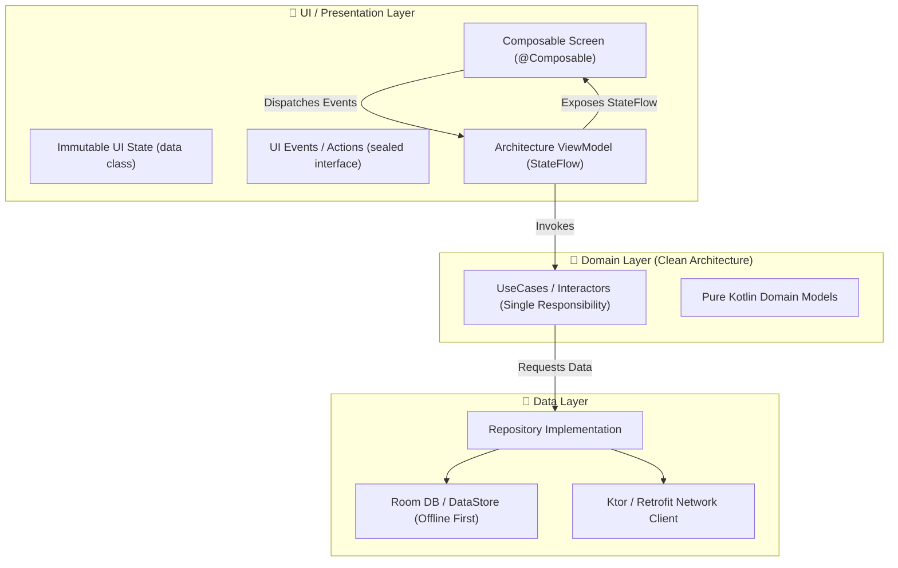

# 📱 Senior Android Engineer Agent Blueprint

When building production Android apps with an AI agent in Android Studio, general-purpose LLMs tend to generate outdated patterns (synthetic views, legacy XML, raw LiveData, god ViewModels, string routes, and unoptimized Compose recompositions).

This blueprint outlines the **exact architectural baseline** required to transform an AI agent into a **Staff / Senior Android Engineer**.

---

## 🏛️ Modern Architecture Stack (2025/2026 Standards)



---

## 💎 Core Senior Tenets

### 1. Unidirectional Data Flow (UDF) & Immutable State
- UI state is represented by a single immutable data class:
  ```kotlin
  data class UserProfileUiState(
      val isLoading: Boolean = false,
      val user: User? = null,
      val errorMessage: String? = null
  )
  ```
- Events/User actions are modeled as a `sealed interface`:
  ```kotlin
  sealed interface UserProfileUiEvent {
      data object Refresh : UserProfileUiEvent
      data class UpdateName(val newName: String) : UserProfileUiEvent
  }
  ```
- State is collected in Composable using lifecycle awareness:
  ```kotlin
  val uiState by viewModel.uiState.collectAsStateWithLifecycle()
  ```

### 2. Feature-First Modularization
Avoid monolithic `:app` modules. Organize the project into granular modules:
- `:core:model` (Domain entities)
- `:core:database` (Room tables & DAOs)
- `:core:network` (API client & serialization)
- `:core:designsystem` (Theme, typography, shared UI components)
- `:feature:auth` (Authentication screens & flows)
- `:feature:dashboard` (Main application experience)

### 3. Type-Safe Navigation
- Replace deprecated string routes (`"profile/{id}"`) with **Navigation 3** or **KotlinX Serialization Type-Safe Navigation**:
  ```kotlin
  @Serializable
  data class ProfileRoute(val userId: String)
  ```

### 4. Senior UI/UX Sensibilities
- **Scaffold Padding Compliance**: Always apply `innerPadding` from `Scaffold` to the root content container.
- **Material 3 Expressive**: Dynamic Color theming, elevation tokens, and shape scales.
- **Accessibility (TalkBack)**: Always provide descriptive `contentDescription` or explicitly use `clearAndSetSemantics` / `contentDescription = null` for decorative icons.
- **Interactive Feedback**: Haptic feedback on primary button taps, ripple animations, and loading skeletons instead of jarring spinners.

---

## 📦 Bundled Repositories Powering This Agent

1. **[[Claude Android Ninja (Modular Arch & Navigation 3)]]**: Modular structure, clean DI, Gradle conventions.
2. **[[Jetpack Compose UI-UX Master Skill]]**: Pixel-perfect UI design, motion, and accessibility.
3. **[[Compose Performance & Quality Audit Skills]]**: Recomposition skipping, stability annotations, and linting.
4. **[[Complete Senior Android & UI-UX .cursorrules]]**: Drop-in configuration for Cursor, Claude Code, and Android Studio.
