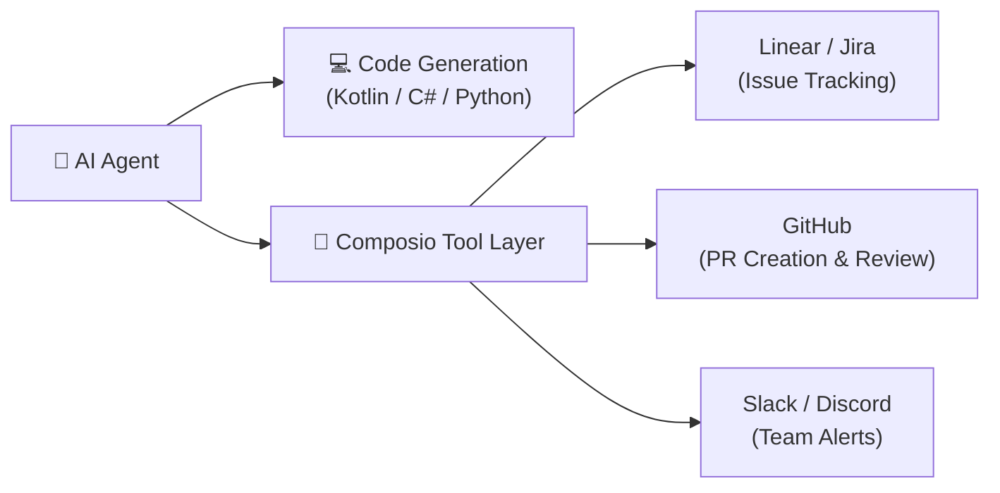

# ⚡ Awesome Claude Skills & Composio Ecosystem

For developers using **Claude Code**, **Claude Desktop**, or any agent following the Anthropic Tool / Skill specification, these repositories offer hundreds of verified integrations.

---

## 📦 Key Repositories

### 1. travisvn/awesome-claude-skills
* **Repository**: [travisvn/awesome-claude-skills](https://github.com/travisvn/awesome-claude-skills)
* **Highlights**:
  - Focuses on developer workflow customization, terminal productivity, and autonomous testing.
  - Contains curated skills for Test-Driven Development (TDD), automated git staging, and AST refactoring.

### 2. ComposioHQ/awesome-claude-skills
* **Repository**: [ComposioHQ/awesome-claude-skills](https://github.com/ComposioHQ/awesome-claude-skills)
* **Highlights**:
  - Maintained by the Composio team, connecting AI agents with 250+ enterprise tools (Jira, Linear, GitHub, Slack, Notion, AWS, Supabase).
  - Out-of-the-box authentication handling (OAuth2, API keys) so your agent can update ticket statuses, post PR review links, or query production analytics.

### 3. karanb192/awesome-claude-skills
* **Repository**: [karanb192/awesome-claude-skills](https://github.com/karanb192/awesome-claude-skills)
* **Highlights**:
  - Clean collection of verified skills for specialized programming tasks, database tuning, and API design.

---

## 🚀 How These Skills Elevate Coding Agents

When building an Android app or a game engine project:
1. Agent solves the feature or bug in code.
2. Agent runs local verification tests.
3. Via Composio / Claude Skills, it automatically marks the Jira/Linear ticket as resolved, includes the commit diff, and notifies the team.
