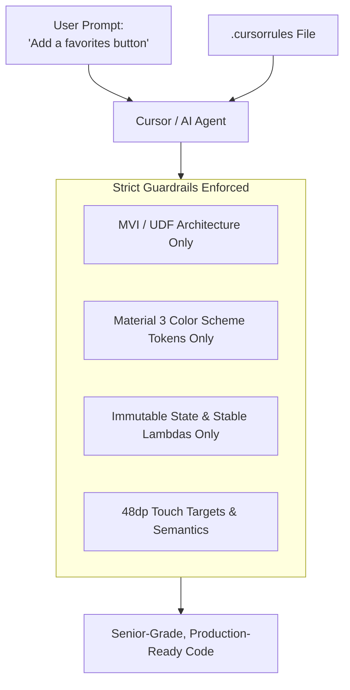

# 📜 Awesome Cursorrules Catalog

* **Repository**: [PatrickJS/awesome-cursorrules](https://github.com/PatrickJS/awesome-cursorrules)
* **Stars**: Over 20,000+ GitHub Stars
* **Directory**: [cursorlist.com](https://cursorlist.com)

The **Awesome Cursorrules** repository is the standard community repository for project-level `.cursorrules` and AI coding instructions. It spans dozens of programming languages, game engines, mobile frameworks, and full-stack environments.

---

## 🎯 What Makes a Great `.cursorrules` File?
A `.cursorrules` file instructs the agent to conform to specific architectural constraints before it writes a single line of code.

---

## 📂 Key Templates Found in the Catalog

1. **Android Native (Kotlin & Compose)**:
   - Rules enforcing Kotlin coroutines lifecycle scoping, StateFlow, Hilt, Material 3, and avoiding XML/synthetic bindings.
2. **Game Development (Unity & Unreal Engine)**:
   - Rules preventing heavy operations inside `Update()` or `Tick()`, enforcing ScriptableObjects, and adhering to Unreal C++ macro standards (`UPROPERTY()`, `UFUNCTION()`).
3. **Frontend & Mobile UI/UX**:
   - Modern design tokens, responsive breakpoints, Tailwind 4, Flutter, SwiftUI, and React Native.

---

## 📥 Practical Use
Whenever starting a new repo:
1. Browse `awesome-cursorrules` for the matching technology stack.
2. Copy the template into your project's root `.cursorrules` (or `.agent/rules/`).
3. For Android Kotlin projects, see the refined, comprehensive configuration in [[Complete Senior Android & UI-UX .cursorrules]].
