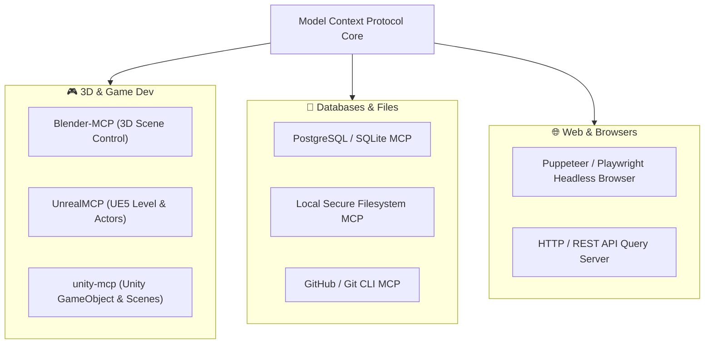

# 🔌 Awesome MCP Servers Directory

The **Model Context Protocol (MCP)**, open-sourced by Anthropic, has become the universal open standard for giving AI models secure, programmatic access to databases, file systems, tools, APIs, and native local software (like Blender, Unreal Engine, and Unity).

---

## 🧭 Key Aggregation Hubs

* **[wong2/awesome-mcp-servers](https://github.com/wong2/awesome-mcp-servers)**: The most widely referenced and star-rated directory of MCP servers.
* **[punkpeye/awesome-mcp-servers](https://github.com/punkpeye/awesome-mcp-servers)**: Deeply categorized list by technical domains.
* **[mcpservers.org](https://mcpservers.org/)**: Interactive searchable index with installation commands and compatibility ratings.

---

## 🏆 Top Essential MCP Servers by Category

### 1. Developer Productivity & Version Control
- **GitHub MCP**: Search PRs, create branches, review diffs, and inspect issues directly inside agent context.
- **Git MCP**: Run safe local git operations (status, diff, branch, stage).
- **SQLite / PostgreSQL MCP**: Read schemas, run queries, and optimize SQL performance in real-time.

### 2. Browser & Automation
- **Playwright / Puppeteer MCP**: Headless browser automation, visual regression screenshotting, and automated web testing.
- **Brave Search / Exa MCP**: Fast web search and deep research grounding for coding agents.

### 3. Native DCC & Game Engines
- **Blender-MCP**: Direct python execution, geometry nodes, material graph. (See [[Blender Agent Skills & Blender-MCP]])
- **UnrealMCP**: Blueprint introspection and asset manipulation. (See [[Unreal Engine 5 MCP & Skills]])
- **Unity-MCP**: GameObject and scene control. (See [[Unity MCP & Game Development Skills]])
