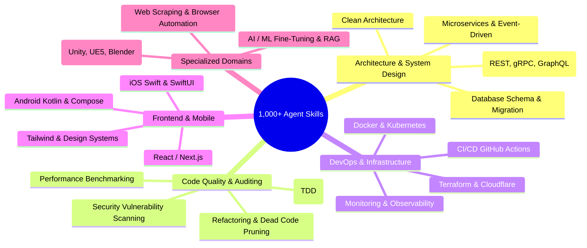

# 📚 VoltAgent Awesome Agent Skills (1000+ Skills)

* **Repository**: [VoltAgent/awesome-agent-skills](https://github.com/VoltAgent/awesome-agent-skills)
* **Secondary Hub**: [sickn33/agentic-awesome-skills](https://github.com/sickn33/agentic-awesome-skills) (2,100+ skills)

While many prompt lists contain AI-generated fluff, **VoltAgent/awesome-agent-skills** is a curated, production-tested library of over 1,000 skills used directly by professional software engineering teams.

---

## 🧭 Major Skill Categories in the Bundle



---

## 🌟 High-Value Skills You Can Cherry-Pick

1. **Security & Vulnerability Audit (`security-audit`)**:
   - Scans dependencies, OWASP Top 10 vulnerabilities, API key leaks, and improper input sanitization.
2. **Database Migration Specialist (`db-migration`)**:
   - Generates backward-compatible SQL and Room/Prisma schema migrations without locking production tables.
3. **API Contract & OpenAPI Generator (`api-contract`)**:
   - Keeps code and Swagger/OpenAPI specs strictly in sync with strict contract testing.
4. **Git Workflow & Release Manager (`git-workflow`)**:
   - Creates semantic conventional commits (`feat:`, `fix:`, `chore:`), generates changelogs, and drafts pull requests with comprehensive test summaries.

---

## 📥 How to Explore & Install
You can browse skills in their catalog and add them via Git or `npx skills`:
```bash
# Clone to inspect locally
git clone https://github.com/VoltAgent/awesome-agent-skills.git

# Or add specific skills directly to your project
npx skills add VoltAgent/awesome-agent-skills --skill security-audit
```
