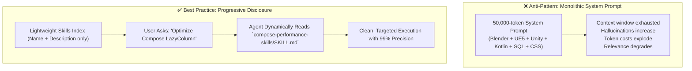

# 🧠 Agent Skills Best Practices & Progressive Disclosure

As AI coding agents take on increasingly complex multi-domain projects (such as 3D asset generation, game mechanics, and native Android development in a single company), structuring skills effectively is vital.

---

## 🛑 The Monolith Problem vs. Progressive Disclosure



---

## 📐 Anatomy of a Production-Grade `SKILL.md`

Every standard skill should follow this format:

```markdown
---
name: compose-performance-skills
description: Deep optimization guidelines for Jetpack Compose. Use when reviewing recompositions, layout stability, or lazy lists.
version: 1.0.0
author: skydoves
tags: [android, compose, performance]
---

# Jetpack Compose Performance Guidelines

## When to Activate This Skill
- The user asks to optimize Compose UI performance or fix lag.
- The user introduces LazyColumn, LazyRow, or complex state animations.

## Core Rules
1. Recomposition Skipping: Always use `@Immutable` or `ImmutableList`.
2. Deferred Reads: Always use `Modifier.offset { ... }` instead of direct value passing.

## Verification Checklist
- [ ] Are keys defined for all `items()`?
- [ ] Are lambda parameters stabilized?
```

---

## ⚡ Golden Rules for AI Agent Workflows
1. **Scope Down**: Each skill should do ONE domain exceptionally well (e.g., separate `android-navigation` from `compose-performance`).
2. **Deterministic Scripts**: If a task can be verified by a deterministic script (e.g., `./gradlew lint` or `bpy.ops.wm.save_mainfile()`), equip the skill with a script rather than relying on LLM guesses.
3. **Keep Context Fresh**: Update skills with `npx skills update` to incorporate latest API changes and community improvements.
