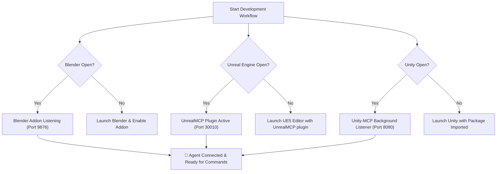

# ⚙️ MCP Configuration for Game Dev (Blender, UE5, Unity)

This guide provides the exact configuration blocks to connect Claude Desktop, Cursor, Antigravity, or Windsurf to local instances of Blender, Unreal Engine 5, and Unity.

---

## 📄 Complete `mcpServers` JSON Configuration

Add this block to your agent configuration file:
* **Claude Desktop**: `%APPDATA%\Claude\claude_desktop_config.json`
* **Cursor**: `Settings` > `Features` > `MCP Servers` or `.cursor/mcp.json`
* **Antigravity / Gemini CLI**: `.gemini/antigravity-cli/mcp_servers.json`

```json
{
  "mcpServers": {
    "blender": {
      "command": "node",
      "args": ["C:/Tools/Blender-mcp/build/index.js"],
      "env": {
        "BLENDER_PORT": "9876",
        "BLENDER_HOST": "localhost"
      }
    },
    "unreal_engine": {
      "command": "python",
      "args": ["-m", "unreal_mcp", "--port", "30010"],
      "env": {
        "UNREAL_PROJECT_PATH": "C:/Projects/MyUnrealGame/MyGame.uproject"
      }
    },
    "unity": {
      "command": "node",
      "args": ["C:/Tools/unity-mcp/dist/index.js"],
      "env": {
        "UNITY_PORT": "8080"
      }
    }
  }
}
```

---

## 🔌 Connection Checklist



### 1. Blender Setup
1. Clone `Gorav22/Blender-mcp`.
2. Run `npm install && npm run build` inside the cloned repository.
3. Install and activate the python addon inside Blender.

### 2. Unreal Engine 5 Setup
1. Clone `kvick-games/UnrealMCP` into your project's `Plugins/UnrealMCP` directory.
2. In Unreal Editor: `Edit` > `Plugins` > Enable **UnrealMCP**.
3. Restart Editor to initialize the remote execution socket.

### 3. Unity Setup
1. Add `https://github.com/CoplayDev/unity-mcp.git` via Unity Package Manager.
2. Ensure the WebSocket service is started in `Window` > `Unity MCP Controller`.
