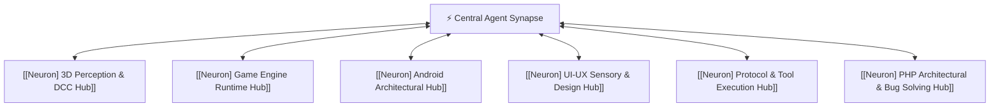

# 🧬 [Neuron] Central Agent Synapse

The central axon of the AI second brain. It directs intent and passes activations between domain-specific cortical hubs.

## Synaptic Dendrites & Efferents
- Connects to:
  - [[00 - 🧠 AI Agent Skills Second Brain (MOC)]]
  - [[Neuron - Progressive Disclosure Gateway]]
  - [[Neuron - Universal Skills CLI Router]]
  - [[Neuron - Model Context Protocol Client]]
  - [[Neuron - Security Vulnerability Scanning]]
  - [[Neuron - Automated Git & Conventional Commits]]
  - [[Neuron] PHP Architectural & Bug Solving Hub]
  - [[Neuron - PHPStan Level 9 Static Analysis]]
  - [[Neuron - Xdebug 3 & Step-Through Tracing]]
