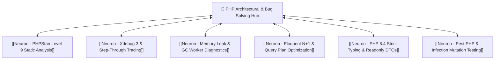

# 🐘 [Neuron] PHP Architectural & Bug Solving Hub

The specialized cognitive center for enterprise PHP application stability, performance tuning, and deep root-cause bug resolution.

## Synaptic Dendrites & Efferents
- Connects to:
  - [[Neuron] Central Agent Synapse]
  - [[Neuron] Protocol & Tool Execution Hub]
  - [[Senior PHP Bug Solving & Architecture Blueprint]]
  - [[Complete Senior PHP & Bug Solving .cursorrules]]
  - [[Neuron - Security Vulnerability Scanning]]
  - [[Neuron - Offline-First Room Database]] (Cross-architectural comparison)
