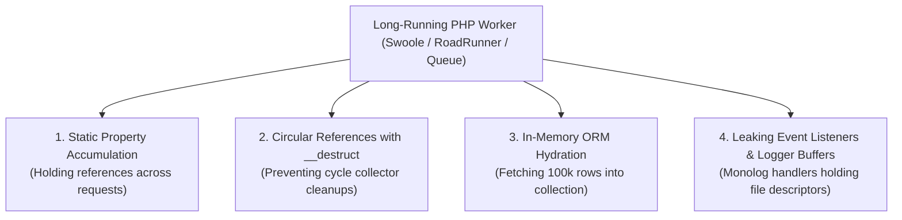

# 🧠 Memory Leak Detection & Long-Running Worker Tuning

In traditional PHP-FPM, PHP scripts die after each request, sweeping all allocated memory clean. However, in modern PHP—such as **Laravel Octane (Swoole / RoadRunner)**, **FrankenPHP worker mode**, and **queue workers (Laravel Horizon / Symfony Messenger)**—processes live for hours or days.

A Senior PHP Developer understands how memory leaks manifest in persistent processes and how to diagnose and prevent them.

---

## 🛑 The 4 Deadly Memory Leaks in PHP Workers



---

## 🛠️ Diagnostics & Code Fixes

### 1. Static Property Leak
- ❌ **The Bug**:
  ```php
  class MetricsTracker {
      public static array $requests = []; // Persists across every HTTP request!
      public static function track($req) {
          self::$requests[] = $req; // Worker OOMs after 10,000 requests
      }
  }
  ```
- ✅ **The Fix**:
  Register a worker reset callback or avoid static state:
  ```php
  // In Octane / RoadRunner service provider:
  Octane::flush(function () {
      MetricsTracker::$requests = [];
  });
  ```

### 2. Large Query Memory Exhaustion
- ❌ **The Bug**:
  ```php
  // Hydrates 50,000 Eloquent models at once (Consumes 400MB RAM)
  $logs = AuditLog::where('created_at', '<', now()->subYear())->get();
  ```
- ✅ **The Fix**: Use `chunkById()` or lazy collections with `cursor()`:
  ```php
  // Memory usage stays under 10MB indefinitely (O(1) complexity)
  AuditLog::where('created_at', '<', now()->subYear())
      ->chunkById(1000, function ($logs) {
          foreach ($logs as $log) {
              $log->delete();
          }
      });
  ```

### 3. Explicit Garbage Collection Diagnostics
You can inspect memory usage during suspect loops:
```php
echo "Memory Before: " . memory_get_usage(true) / 1024 / 1024 . " MB\n";

// Suspect processing block
unset($largePayload);
gc_collect_cycles(); // Force cyclic reference collection

echo "Memory After: " . memory_get_usage(true) / 1024 / 1024 . " MB\n";
```

### 4. Database Query Log Leaking
Laravel automatically logs queries in memory when debugging. In workers, this leads to an inevitable crash:
```php
// In long-running commands/workers:
DB::disableQueryLog();
```
