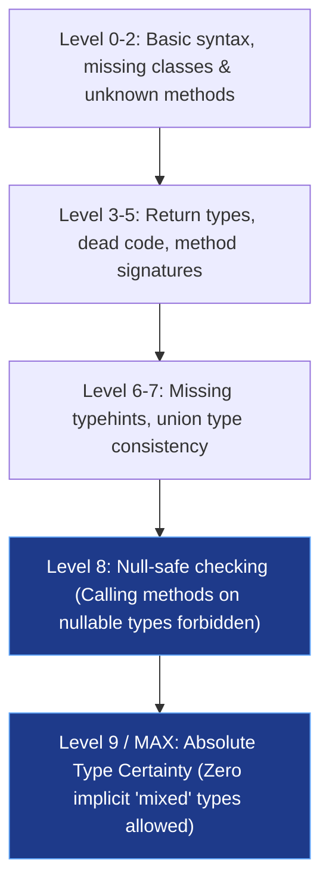

# 🔍 PHPStan Level 9 & Static Analysis Mastery

A Senior PHP Developer uses static analysis to prevent 95% of runtime crashes—especially `TypeError`, `Call to a member function on null`, and undefined array key notices—before code ever reaches staging.

---

## 📊 The Strictness Hierarchy



---

## 🛑 Common Anti-Patterns & Senior Solutions

### 1. The `Call to a member function on null` Bug
- ❌ **Junior Code**:
  ```php
  $user = User::find($id);
  return $user->email; // Crash if $user is null
  ```
- ✅ **Senior Level 9 Fix**:
  ```php
  $user = User::findOrFail($id); // Throws ModelNotFoundException
  // OR explicit narrowing:
  $user = User::find($id);
  if ($user === null) {
      throw new ResourceNotFoundException("User {$id} does not exist.");
  }
  return $user->email;
  ```

### 2. Eliminating `mixed` in Collections & Generics
- ❌ **Junior Code**:
  ```php
  public function getOrders(): array { ... }
  ```
- ✅ **Senior Level 9 Fix (Generics via PHPDoc)**:
  ```php
  /**
   * @return array<int, OrderDTO>
   */
  public function getOrders(): array { ... }
  ```

### 3. Exhaustive Enums & Match Expressions
When handling state machines, PHPStan verifies all Enum cases are handled:
```php
enum PaymentStatus: string {
    case Pending = 'pending';
    case Completed = 'completed';
    case Failed = 'failed';
    case Refunded = 'refunded';
}

// PHPStan Level 9 throws an error if ANY case is omitted without a default!
return match ($status) {
    PaymentStatus::Pending => $this->handlePending(),
    PaymentStatus::Completed => $this->handleSuccess(),
    PaymentStatus::Failed => $this->handleFailure(),
    PaymentStatus::Refunded => $this->handleRefund(),
};
```

---

## ⚙️ Recommended `phpstan.neon` Configuration
```neon
includes:
    - vendor/larastan/larastan/extension.neon # or symfony extension

parameters:
    level: 9
    paths:
        - app
        - src
        - tests
    checkGenericClassInNonGenericObjectType: true
    checkMissingIterableValueType: true
    treatPhpDocTypesAsCertain: false
```
