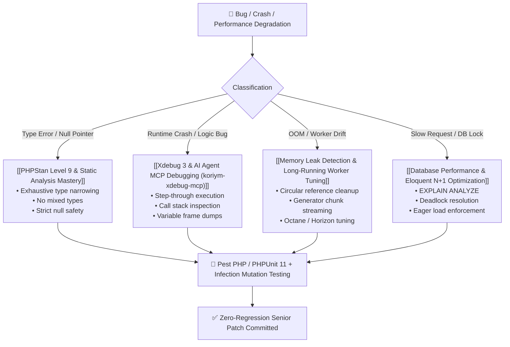

# 🐘 Senior PHP Bug Solving & Architecture Blueprint

A Staff/Senior PHP engineer does not simply "patch" a symptom; they diagnose root causes through deterministic profiling, static analysis, and architectural isolation.

This blueprint establishes the **gold standard for high-performance, bug-free PHP 8.2 / 8.3 / 8.4 applications** (Laravel, Symfony, and modern decoupled architectures).

---

## 🏛️ The Senior PHP Diagnostic Loop



---

## 💎 Core Tenets of a Senior PHP Engineer

### 1. Modern PHP 8.3 / 8.4 Standards
- **Strict Typing Always**: `declare(strict_types=1);` in every single file without exception.
- **Readonly Data Transfer Objects (DTOs)**:
  ```php
  readonly final class OrderCheckoutDTO
  {
      public function __construct(
          public Uuid $orderId,
          public Money $totalAmount,
          public OrderStatus $status,
          /** @var array<OrderItemDTO> */
          public array $items,
      ) {}
  }
  ```
- **Pattern Matching over Giant Switches**: Exhaustive `match()` expressions mapped to backed Enums so unhandled cases throw compile-time or static analysis errors.
- **Null Safety**: Zero tolerance for loose comparisons (`==`). Strict `===` and explicit type guards (`is_null()`, `instanceof`).

### 2. Eliminating Hidden Concurrency & Long-Running Worker Bugs
In modern asynchronous PHP (Laravel Octane with Swoole/RoadRunner, FrankenPHP worker mode, or queue consumers):
- **Never store request state in static properties or singletons**: Leads to cross-tenant memory leakage.
- **Always reset container bindings after each job/request**.
- **Use Generators (`yield`) or Chunking** when querying or parsing files larger than 10MB:
  ```php
  // ❌ Fatal Error: Allowed memory size of 134217728 bytes exhausted
  $users = User::all();

  // ✅ Constant memory usage (O(1) footprint)
  foreach (User::query()->cursor() as $user) {
      $this->processUser($user);
  }
  ```

### 3. Hexagonal / Domain-Driven Architecture
- **Controllers / Commands are Thin**: Max 10-15 lines. They validate inputs, call an Action / UseCase, and return a Resource / DTO.
- **Domain Logic is Framework-Agnostic**: Core domain entities and business rules do not import framework facades or ORM base classes.
- **Transactions are Atomic**: Always wrap state-mutating multi-table operations in database transactions with explicit retry policies for deadlocks (`DB::transaction(..., 3)`).

---

## 🛠️ Essential Tooling Ecosystem
1. **PHPStan / Psalm**: Level 9 (or `max`) with zero baselined errors.
2. **Xdebug 3 MCP (`koriym/xdebug-mcp`)**: Connects AI agents directly into Xdebug socket for natural language debugging.
3. **Pest PHP / PHPUnit 11**: Expressive testing with datasets, mocking, and architecture tests.
4. **Infection**: Mutation testing framework that modifies AST to verify tests actually fail when bugs are introduced.
5. **Rector**: Automated, AST-safe refactoring for PHP version migrations and code cleanups.
