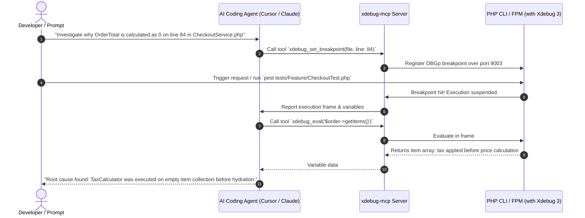

# 🐞 Xdebug 3 & AI Agent MCP Debugging (koriym-xdebug-mcp)

* **Repository**: [koriym/xdebug-mcp](https://github.com/koriym/xdebug-mcp)
* **Author**: Akihito Koriyama
* **Protocol**: Model Context Protocol (MCP) + Xdebug 3 DBGp protocol

---

## ⚡ What is `xdebug-mcp`?

Traditional AI agents only read static text files. When a subtle runtime bug occurs (e.g. an unexpected null in a nested array or a corrupted transaction state), an agent without debugger access is forced to guess.

**`xdebug-mcp`** connects your AI agent directly into PHP's **Xdebug 3** engine via the Model Context Protocol. The agent can:
1. Set conditional breakpoints at specific lines.
2. Step into (`step_into`), step over (`step_over`), or step out of functions.
3. Dump live call stacks and evaluate local/global variable scopes in real time.
4. Read execution traces to discover the exact line where an unexpected mutation occurred.

---

## 🏗️ Architecture Flow



---

## ⚙️ Quick Setup Guide

### 1. Configure `php.ini` for Xdebug 3:
```ini
[xdebug]
zend_extension=xdebug.so ; (or php_xdebug.dll on Windows)
xdebug.mode=develop,debug,trace
xdebug.start_with_request=yes
xdebug.client_port=9003
xdebug.client_host=127.0.0.1
xdebug.trace_format=1
```

### 2. Register `xdebug-mcp` in Agent Configuration:
```json
{
  "mcpServers": {
    "xdebug": {
      "command": "node",
      "args": ["path/to/xdebug-mcp/dist/index.js"],
      "env": {
        "XDEBUG_PORT": "9003"
      }
    }
  }
}
```

---

## 🎯 High-Value Diagnostic Commands for Agents
- `xdebug_trace_start`: Records memory usage and function timings to detect recursion or runaway loops.
- `xdebug_get_stack`: Prints the complete backtrace leading to an uncaught exception.
- `xdebug_eval`: Evaluates expressions directly within the local execution frame without modifying source code.
